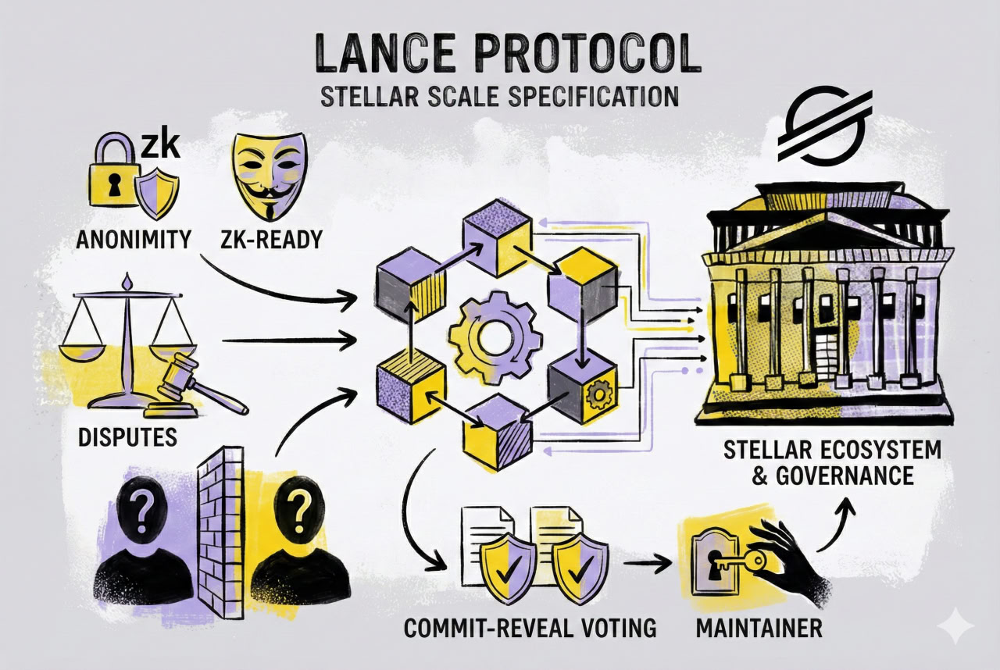

    
   
   

# Lance Protocol: Zero-Knowledge Private Voting for Soroban

## Problem

Most blockchain voting systems expose voter identities or allow vote correlation through transaction tracking.  
Even commit–reveal schemes leak metadata and require multiple transactions, complicating integration for other dApps.  
On Stellar, there is no standardized module that allows smart contracts to request anonymous, verifiable, tamper-proof votes that anyone can audit but no one can deanonymize.

In Web3 arbitration and governance systems, game-theory mechanisms break down because votes are often public during the voting phase.  
Jurors can simply wait and vote for the side that is already winning, maximizing rewards instead of voting honestly.  
Commit–reveal was introduced to hide votes temporarily, but the UX is poor: users must stake, commit, wait, and reveal in multiple transactions.  
If they're offline during the reveal phase, the vote is lost.

Projects building governance, arbitration, reputation, or automated decision workflows must re-implement all of this logic by themselves, creating fragmented solutions with inconsistent security guarantees.

Lance Protocol solves these problems by providing a reusable, zero-knowledge voting layer that any Stellar dApp can integrate.  
Votes remain private, non-linkable, and verifiably valid, while the protocol enforces correct behavior without requiring jurors to wait or perform extra steps.  
This allows every project on Stellar to outsource trustworthy, private, game-theory-safe decision-making to a single shared module.

## Solution

**Lance Protocol** is a reusable, zero-knowledge voting layer for Soroban.  
It enables any Stellar smart contract to outsource voting, dispute resolution, or decision-making to a **private, ZK-verified, commit–reveal system**.

The protocol is built around:

1. **Encrypted Commitments**  
   Voters submit commitments derived from their vote + secret randomness.

2. **Zero-Knowledge Reveal**  
   Using BLS12-381 signature verification (inspired by the Tansu approach), voters generate a proof that:
   - their revealed vote matches the original commitment  
   - the vote is well-formed  
   - the voter is authorized  
   …without revealing any other information.

3. **On-Chain Proof Verification**  
   The Soroban contract validates the BLS12-381 proof directly on-chain, ensuring correctness without trust assumptions.

4. **Universal Integration for dApps**  
   Any Soroban contract can:
   - open a vote  
   - assign eligible voters  
   - receive private encrypted votes  
   - trigger ZK reveal and final tally  
   - automatically enforce the result inside their own logic  

Lance Protocol becomes a **general-purpose private decision module** for the Stellar ecosystem.

### Why Commit–Reveal + ZKP?
Commit–reveal prevents early manipulation, but normally leaks metadata or allows commit–grinding attacks.  
Adding a zero-knowledge reveal stage:
- ensures commitments cannot be forged  
- ensures the revealed value truly matches the committed vote  
- preserves anonymity even if network metadata is analyzed  
- keeps computational costs low enough for Soroban

This satisfies the hackathon requirement of implementing **real zero-knowledge cryptography**, not just hidden hashes.

## Architecture Overview

### On-Chain (Soroban)
- Vote initialization  
- Encrypted commit submission  
- BLS12-381 based ZK proof verifica

## Screenshots

### Front-End

### Running script 1

### Running script 2

### Public Functions

### Transactions
