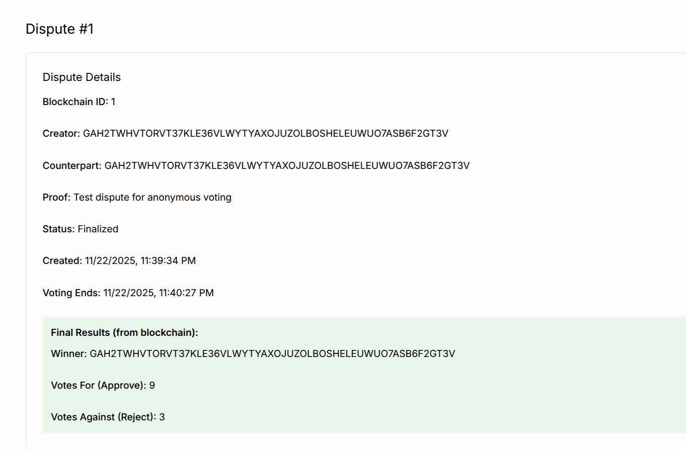
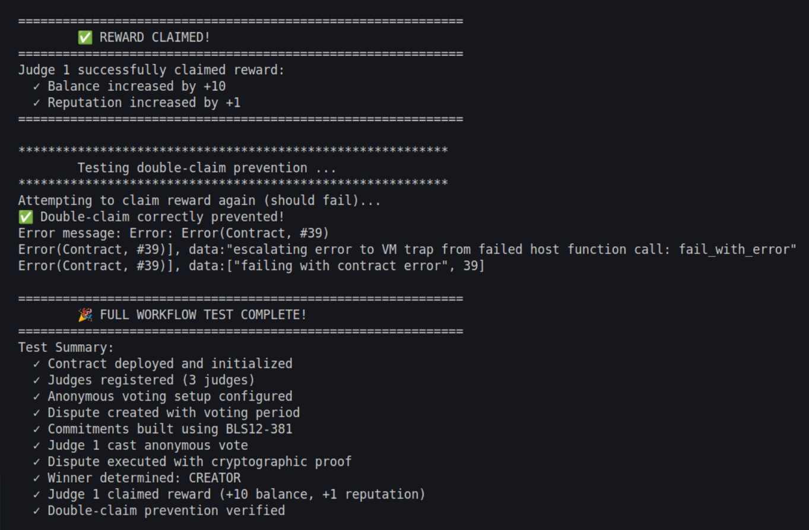
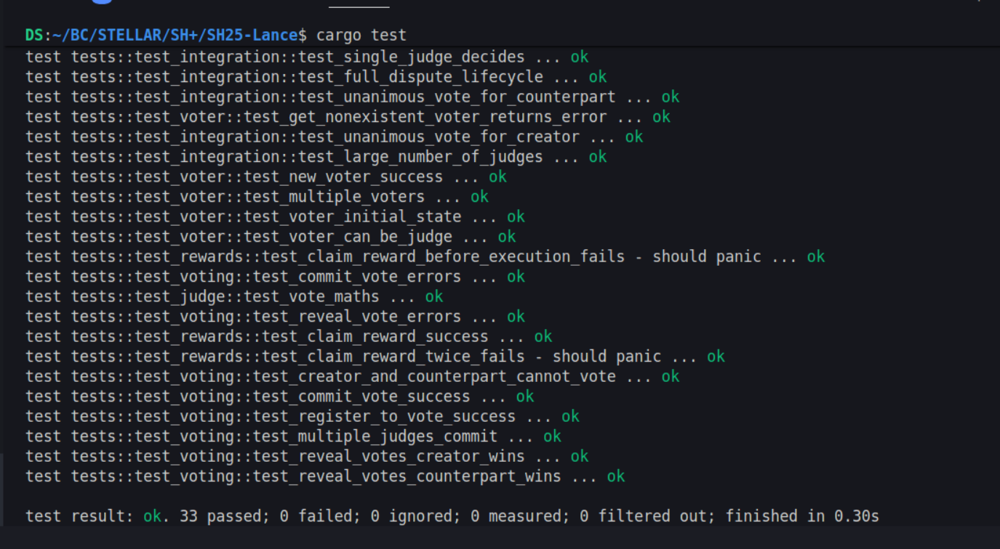
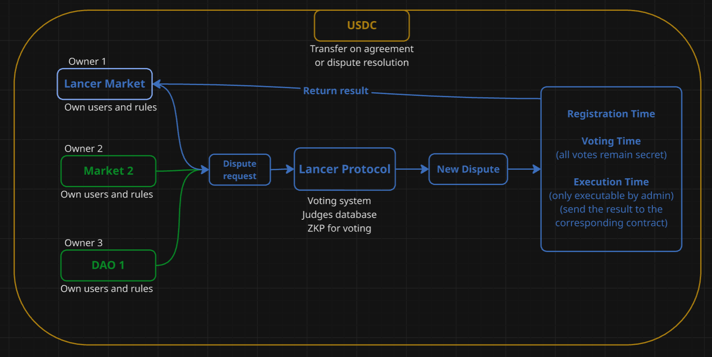

<div align="center">
    
  </br>
  </br>
</div>

# Lance Protocol: Zero-Knowledge Private Voting for Soroban
# Lance Protocol: Zero-Knowledge Private Voting for Soroban

## Problem

Most blockchain voting systems expose voter identities or allow vote correlation through transaction tracking.  
Even commit–reveal schemes leak metadata and require multiple transactions, complicating integration for other dApps.  
On Stellar, there is no standardized module that allows smart contracts to request anonymous, verifiable, tamper-proof votes that anyone can audit but no one can deanonymize.

In Web3 arbitration and governance systems, game-theory mechanisms break down because votes are often public during the voting phase.  
Jurors can simply wait and vote for the side that is already winning, maximizing rewards instead of voting honestly.  
Commit–reveal was introduced to hide votes temporarily, but the UX is poor: users must stake, commit, wait, and reveal in multiple transactions.  
If they're offline during the reveal phase, the vote is lost.

Projects building governance, arbitration, reputation, or automated decision workflows must re-implement all of this logic by themselves, creating fragmented solutions with inconsistent security guarantees.

Lance Protocol solves these problems by providing a reusable, zero-knowledge voting layer that any Stellar dApp can integrate.  
Votes remain private, non-linkable, and verifiably valid, while the protocol enforces correct behavior without requiring jurors to wait or perform extra steps.  
This allows every project on Stellar to outsource trustworthy, private, game-theory-safe decision-making to a single shared module.


## Solution

**Lance Protocol** is a reusable, zero-knowledge voting layer for Soroban.  
It enables any Stellar smart contract to outsource voting, dispute resolution, or decision-making to a **private, ZK-verified, commit–reveal system**.

The protocol is built around:

1. **Encrypted Commitments**  
   Voters submit commitments derived from their vote + secret randomness.

2. **Zero-Knowledge Reveal**  
   Using BLS12-381 signature verification (inspired by the Tansu approach), voters generate a proof that:
   - their revealed vote matches the original commitment  
   - the vote is well-formed  
   - the voter is authorized  
   …without revealing any other information.

3. **On-Chain Proof Verification**  
   The Soroban contract validates the BLS12-381 proof directly on-chain, ensuring correctness without trust assumptions.

4. **Universal Integration for dApps**  
   Any Soroban contract can:
   - open a vote  
   - assign eligible voters  
   - receive private encrypted votes  
   - trigger ZK reveal and final tally  
   - automatically enforce the result inside their own logic  

Lance Protocol becomes a **general-purpose private decision module** for the Stellar ecosystem.

### Why Commit–Reveal + ZKP?
Commit–reveal prevents early manipulation, but normally leaks metadata or allows commit–grinding attacks.  
Adding a zero-knowledge reveal stage:
- ensures commitments cannot be forged  
- ensures the revealed value truly matches the committed vote  
- preserves anonymity even if network metadata is analyzed  
- keeps computational costs low enough for Soroban

This satisfies the hackathon requirement of implementing **real zero-knowledge cryptography**, not just hidden hashes.

## Architecture Overview

### On-Chain (Soroban)
- Vote initialization  
- Encrypted commit submission  
- BLS12-381 based ZK proof verifica

- **Frontend**: React (Next.js) for a simple UI where clients post jobs (title, budget in USDC/XLM) and freelancers accept/submit work. Hosted on Vercel for demo.
- **Backend (Light)**: Node.js with Stellar SDK for wallet interactions and job metadata storage (off-chain for simplicity, IPFS optional for decentralization).
- **Blockchain Layer**: Stellar's Soroban smart contracts (Rust) handle escrow logic: create, fund, submit work, and release/timeout funds. Stellar ledger stores transactions; Horizon API queries state.
- **Storage**: IPFS (via Pinata) for job descriptions and work proof (e.g., file hashes), ensuring decentralized data.
- **User Auth**: Freighter wallet for Stellar account management and transaction signing.


## Stellar Components Used
- **Stellar SDK**: Integrates frontend with Stellar for account management, payments, and contract calls.
- **Soroban**: Rust-based smart contracts for escrow (create, fund, release, timeout). Deployed on Futurenet testnet.
- **Horizon API**: Queries ledger for transaction history and account balances.
- **Freighter Wallet**: Browser extension for user authentication and transaction signing.
- **Stellar Assets**: USDC for stable payments, XLM for native transactions. Trustlines ensure secure asset handling.
- **Stellar Scaffold**: Displays transparent transaction logs for demo.

## Installation Steps
### Prerequisites
- Node.js (v16+)
- Rust (for Soroban contracts)
- Freighter wallet (browser extension)
- Git, npm, and a modern browser

...


## Deployment

### Prerequisites

- Rust toolchain with `wasm32-unknown-unknown` target
- Soroban CLI
- Stellar network access (testnet/mainnet)

### Build, deploy and execute

Inside main folder give permission to script files for being executed with:
```bash
chmod +x ./accounts.sh
chmod +x ./full.sh
```

Execute accounts.sh only once running
```bash
./accounts.sh
```
Execute run.sh only once running to build, optimize and execute transactions
```bash
./full.sh
```

### Front-End

To see our page:
https://lancestellar.vercel.app/

To open our front-end and wallet integration code
https://github.com/artugrande/lance-front/

### Tests

For running test execute
```bash
cargo test
```

## Security Features

- **Access Control**: Only admin and authorized crowdfunding contract can mint
- **Proof Uniqueness**: Prevents duplicate NFTs for the same proof
- **Validation System**: Two-step process (creation + validation)
- **Immutable Records**: Saved metadata provides permanent milestone records

## Testing

Run the test suite:

```bash
cargo test
```

Key test scenarios:
- Contract initialization
- Milestone minting and validation
- Token transfers and approvals
- Campaign progress tracking
- Unauthorized access prevention

## Roadmap

- [x] Develop MVP with main functionalities 
- [x] Soroban Smart Contracts for users, services, disputes and voting interactions
- [x] Develop basic front-end to showcase user interactions 
- [x] Functions and test for deposit funds and withdrow earnings with Blend Capital
- [x] Implement an on-chain reputation system based in Neural Quorum Governance
- [x] Wallet integration with Stellar Wallet Key

- [ ] Evaluate and implement a minimal contract balance to assure liquidity for instant user payments
- [ ] Create registry platform for user verification, offering an optional 'checked' status
- [ ] Create a matching page where users can search and chat before before agreeing to a service
- [ ] Implement premium client tools like talent matching, project management features, or hiring support
- [ ] Develop dashboard for users to manage and track their services and disputes
- [ ] Create analytics system for tracking usage metrics
- [ ] Create mobile app for allowing interactions on smartphones
- [ ] Create NFT smart contract to reward users after reaching certain achievements
- [ ] Implement back-end service for managing no fundamental information off-chain
- [ ] Enhance Stellar SDK integration for broader blockchain interactions
- [ ] Create documentation and video tutorials for better user boarding 
- [ ] Implement support for multiple Stellar-compatible wallet providers
- [ ] Implement governance system for community-driven protocol upgrades


## Screenshots

### Front-End

### Running script 1

### Tests

### Protocol Overflow
